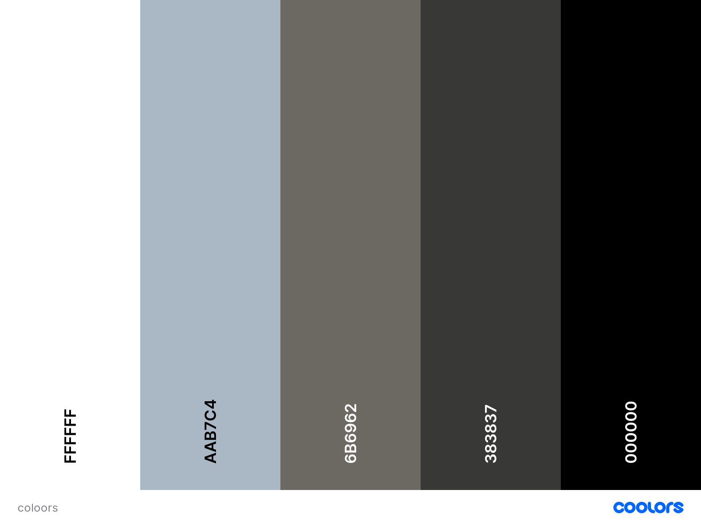

# MG Brands
### **A fourth Milestone Project** 

Live Link : https://mg-brands.herokuapp.com/ 

<p><strong>MG Brands </strong> is an e-commerce website application for those who loves Urban fashion. 
 </p>

<p>Inspired by my onlineshop in the Philippines managed by my sister. I have decided my online shop through facebook and Instagram only since the pandemic started. People shop from home due to lockdowns. I guess this is the right time to make a website for my shop and it is perfectly match with the Milestone project 4. 

## UX 

### **User Stories**

| As a/an        | I want to...        | So that I can...        |
| ------------- |:-------------:| :-----:|
| SHOPPER| browse all available products on the site | find something to buy. |
|        | filter by product category|easily find what I am interested in.|
|        | search by keywords|find the products faster.|
|        | add and view products in my bag|know how much I am spending.|
|        | get delivery discount|afford toI could save|
|        | see my past orders|track how much I spent and buy some products again.|
|        | sort the products by price|see the expensive/cheapest ones first.|
|        | sort the products by rating|see the quality/review first.|
|        | sort the products by name|find the names easily|
|        | sort the products by category|find which one I am looking for first.|
|        | have my shipping details on my profile|complete my purchase faster.|
|        | view product|read more information about it.|
|        | register/login for an account that stores my info|return and navigate the site faster and more intuitively.|
|        | pay at the website|for a convenient shopping|
| STORE OWNER| manage products to add, edit or/and delete products|add more products, make updates to existing ones and/or delete products.|
|            | view product management visble only to admin|secure every changes in the site.|

### **Project Goals**
* Ability for the User to register an account.
* Ability for the User to browse products in different categories.
* Ability for the not registered User to browse products in different categories.
* Ability for the registered User to receive confirmation emails for registration and order confirmation.
* Ability for the registered User to browse products in different categories.
* Ability for the registered User to buy products.
* Ability for the registered User to save items.
* Ability for the registered User to delete items.
* Ability for the registered User to view the order history.
* Ability for the registered User to login / logout from the website.
* Ability for any User to search products.
* Ability for any User to modify the cart by removing unwanted products.
* Ability for the Admin to add, edit and update products and category.
* User friendly website.
* Easy to navigate.
* Mobile first design.

## **Design** 

### **Structure**
The Website is being developed as an e-commerce shop. 
It is suitable for all gender and for all ages. It broken into three categories which focused on the following target audiences:
- **Roles:**
     - New Users (Non-Registered)
     - Returning Users (Registered)
     - Admin (Site Management)

The website needs to enable the user to:
- Register/Login to an account
- Create account
- Search product created in the database 
- View products with the following information:
    - by price
    - by rating
    - by category
    - by clothing
- Save and access the product
- Edit product quantity
- Rating view
- Provide payment and save information


- A conventional Bootstrap light-coloured navbar is available on all pages. A brand logo and site name have been added on the top-left. From the right, you have the cart and sign in options followed by the Navbar in the center. Below the Navbar is the banner and search box at the right of it. Immediately below is a contrasting hero image and call-to-action with 'wear me' button. Ther is an arrow to go back to top when the page is longer.

- The home page was created using the ‘Landing Page’ template from bootstrap. This provides an attractive and informative initial showcase for the product range. When a customer clicks on any of the navbar product links, the resulting product pages are based from bootstrap template. The page body shows products across on larger screens which is reduced in number for smaller devices. 

- The product detail page is based has a plain white background to ensure the product is the main focus.  he layout includes a product title, description, price, category tag, rating, adjustable quantiy 'Keep shopping' and ‘Add to bag’ buttons. 

- The Registration, Sign-up, email confirmation, login and profile pages all use the same functional design 
incorporating the aforementioned header and footer.

<div ></div>

The shopping cart, checkout and checkout success pages are along the same lines.

<div></div>
<br>
<div></div>
<br>
<div></div>

### **Colour Scheme**

- The chosen colour scheme was specifically selected in order to define the tone of the application.

     - A colour palette was developed to create an ambient and familiar environment throughout the site.

     - "COLOORS" is being used for [Color Generator](https://coolors.co/).

    - The background color of product page, log-in, log-out, register, product management, checkout stand out well against the plain white background

    - Additional colors are simply red for the highlight buttons like "wear me". 

    - The selected colours are:

     <div></div>

### **Typography**

- The template typography is [Lato](https://fonts.google.com/specimen/Lato fonts throught the Page to be clear and readable.

- The font color is generally black and white to contast the background 

### **Imagery**
- The landing image features urban impression with youth playing skateboards.  This is to make it clear what the website sells.

<div align="left"></div>

- It has MG Brands logo especially designed by a graphic designer.

<div align="left"></div> 

### **Wireframes** 
 - The wireframes for Desktop, Tablet and Mobile versions are [here.](media/wireframes/wf.png). Zoom in for larger view.
 - Tablet and Mobile views are the same except Ipad pro.

### **Database Schema** 

-  For the products of the website I have created 3 categories:
  - Shoes
  - Bags
  - Caps

**[{"pk": 1, "model": "products.category", "fields": {"name": "shoes", "friendly_name": "Shoes"}}, {"pk": 2, "model": "products.category", "fields": {"name": "bags", "friendly_name": "Bags"}}, {"pk": 4, "model": "products.category", "fields": {"name": "caps", "friendly_name": "Caps"}}]**

- Product has the following example:
  - "pk": 1, "model":
    "sku": "pp5001340155", 
    "name": "Air Jordan 11", 
    "description": "This low top was inspired by the elegant and sophisticated Air Jordan 11..
    "price": 129.90, 
    "category": 1, 
    "rating": 4.6, 
    "image_url": "jordashoes.png", 

## **Features**
- The Bootstrap toolkit was used throughout including:
  - Grid
  - Navbar
  - Cards
  - Forms
  - Buttons
  - Toasts
  
- Notifications
  - Bootstrap toasts is being used.
  <div align="left"></div>

- Cart/Checkout/Checkout success
  - The site has separate pages for cart, checkout and checkout success corresponding to each stage of the purchase process.  The customer is able to alter the quantity in the cart between 1 and 99.  The price for individual products, sub-total of quantity for each product size, overall cart total and order total after shipping cost is shown.

- Checkout
  - Name, email, phone, address and card details are required on the checkout page.  
  - A checkbox provides an option to save the contact and address details back to the profile.

- Free shipping
  - A purchase below 40€ will incur a flat 10% shipping cost.  
  - The shipping cost is waived for orders over 50€.

- Profile
  - Customer’s contact details and order history are saved in their profile.  
  - Contact details can be updated on the profile or check out pages.
  - Security is in place to ensure only the customer who submitted the order can see the order history.

- Add/Edit products
  - A site owner can create new product for the Product Management link on the navbar.  Existing products can be updated via the Edit and Delete links on each item in the product views.

- Search box
  - Full search capability on product titles and description.

- Defensive programming
  - Confirm Deletion
  - HTML validity
  - Non-public pages protected from non-authorised access.
  - Admin pages protected from non-admin access
  - Comprehensive user notifications

- CRUD
  - Site owners have full CRUD capability for products.

- Crispy forms
  - Used to improve function and style of forms.

- AWS S3 hosting
  - Static and media files hosted on AWS S3.

- Responsive on all device sizes tested
  - The use of the Bootstrap grid system and additional media queries enables the site to display effectively on a broad range of desktop, tablet and mobile screen sizes.  For example:
  <br>
  
### **Future development**

-   Customer reviews
-   More Categories and Products
-   Wish List 
-   Product Sizes
-   Change/forget password functionality
-   Calculations for VAT & postage in different countries 
-   Staff page to check all orders
-   Notification if no product stock
-   Handling Errors
-   Graphical display to show goal progress.
-   Title on products page for categories
-   Magnification on product images
-   Pagination
-   Contact form
-   More design on templates
-   Footer
-   Comparison of each related products
-   Hotline
-   Online Chat service
-   More payment options with Bitcoin aswell
-   More Information in readme file about the site
-   More testing
-   Sending E-mails to customers


## **Technologies Used**

### **Languages Used**
-   [HTML5](https://en.wikipedia.org/wiki/HTML5)
-   [CSS3](https://en.wikipedia.org/wiki/Cascading_Style_Sheets)
-   [Javascript](https://en.wikipedia.org/wiki/JavaScript)
-   [Python](https://www.python.org/)
### **Frameworks**
1. [Bootstrap 5.1](https://getbootstrap.com/docs/5.1/getting-started/introduction/)
    - Bootstrap layout, content, components and utilities were used to structure the site and make it responsive.
1. [Django](https://www.djangoproject.com/)
    - Django was used to struture the site.
### **Libraries**
1. [jQuery](https://jquery.com/)
    - jQuery has been used for to launch toast messages, enable increment/decrement functionality in the cart, processing Stripe payments and checking country fields at check out. 
1. [Bootstrap Icons](https://icons.getbootstrap.com/)
    - Bootstrap Icons was used for all site icons.
### **Development & production platforms**
1. [GitPod](https://gitpod.io/)
    - GitPod was used for code editing, version control, committing and pushing to GitHub.
1. [GitHub](https://github.com/)
    - GitHub was used to store and manage project code pushed from GitPod.
1. [Heroku](https://www.heroku.com/about)
    - Heroku was used for hosting the deployed web application.
1. [Postgres](https://www.postgresql.org/)
    - Live database
1. [SQLite](https://www.sqlite.org/index.html)
    - Demo database
1. [AWS S3](https://aws.amazon.com/s3/)
    - Hosting live static and media files.
1. [Stripe](https://stripe.com/en-gb-de)
    - Creation of payment.
### **Other applications**
1. [Unsplash](https://unsplash.com/)
    - Images dowloaded
1. [COLOORS]()
    - Color Generator.
1. [Cloudinary](https://dbdiagram.io/home)
    - Creation of database diagram.
1. [Balsamiq](https://balsamiq.com/)
    - Creation of wireframes.

## **Testing**
See Test report [here.](TESTING.md)

## **Deployment**
### **Making a Local Clone**
1.	Log into GitHub and locate the [Sneaker-Dadi repository](https://github.com/mari-code-l/brands_mg)
2.	Under the repository name, click ‘Clone or download’.
3.	To clone the repository using HTTPS, under ‘Clone with HTTPS’, copy the link.
4.	Open Git Bash
5.	Change the current working directory to the location where you want the cloned directory to be made.
6.	Type git clone, and then paste the URL you copied in step 3.<br>
`$ git clone https://github.com/mari-code-l/brands_mg`<br>
7.	Click Enter.  Your local clone will be created.
8.	Following Stripe documentation, create a Stripe account and in Developers on the API key tab find the public and secret key.
9.	Also in Stripe create a Webhook and find the Webhook secret key.
10.	Create an env.py file to contain the following environment variables.
    ```console
    os.environ.setdefault("SECRET_KEY", "<app secret key>")
    os.environ.setdefault("DEVELOPMENT", "True")
    os.environ.setdefault('STRIPE_PUBLIC_KEY', '<from Stripe>')
    os.environ.setdefault('STRIPE_SECRET_KEY', '<from Stripe>')
    os.environ.setdefault('STRIPE_WH_SECRET', '<from Stripe>')
    ```
11.	Create a .gitignore file ensuring *.sqlite3, *.pyc and __pycache__ are added.
12.	Install all project requirements with `pip install –r requirements.txt` 
13.	Run database migrations
14.	Load category and product fixtures in following order
15.	Create a superuser
16.	Run the app 

### **Deploy to Heroku**
1.	Login to Heroku
2.	Create new app
3.	Add name , choose closest region and click Create app
4.	In Resources create a new Postgres database
5.	Select Hobby Dev-Free plan and click Submit Order Form
6.	In your IDE install dj_database_url and psycopg2
7.	Import dj_database_url in settings.py
8.	Replace default database with a call to dj_database_url.parse and give it the database URL from Heroku
    ```
    DATABASES = {
        'default': dj_database_url.parse('your-url-goes-here')
    }
    ```
9.	Run all migrations again for the Postgres database (see steps 11 to 13 in Making a Local Clone) 
10.	Install gunicorn to act as a webserver
11.	Freeze requirements
12.	Create a Procfile to tell Heroku to create a web dyno to run gunicorn to serve the Django app.  This should contain the following:
13.	Login to Heroku from your IDE using your API key as the password
14.	Temporarily disable collectstatic so Heroku will not collect static files when we deploy.
15.	In Settings, create the following Config Vars
    |**Key**|**Value**|
    |---|---|
    |AWS_ACCESS_KEY_ID|`<AWS ACCESS KEY ID>`|
    |AWS_SECRET_ACCESS_KEY|`<AWS SECRET ACCESS KEY>`|
    |DATABASE_URL|`<POSTGRES DATABASE URL>`|
    |DISABLE_COLLECTSTATIC|`1` |
    |EMAIL_HOST_PASS|`<APP PASSWORD FROM EMAIL ACC>`|
    |EMAIL_HOST_USER|`<EMAIL ACC>`|
    |SECRET_KEY|`<SECRET KEY>`|
    |STRIPE_PUBLIC_KEY|`<STRIPE PUBLIC KEY>`|
    |STRIPE_SECRET_KEY|`<STRIPE SECRET KEY>`|
    |STRIPE_WH_SECRET|`<STRIPE WH SECRET>`|
    |USE_AWS|True|
16.	Add the Heroku hostname to ALLOWED_HOSTS in settings.py
18.	Initialise your IDE with Heroku and push to it.
19.	In Heroku on the Deploy tab select GitHub as Deployment method
20.	Search for respository and click Connect
21.	Click Enable Automatic Deploys

### **Configuring S3**
1.	Create an AWS account
2.	Create a bucket for S3
3.	Uncheck Block all public access and acknowledge settings
4.	Enable static website hosting & Save changes.
5.	Add default values for index, error doc & click Save.
6.	In Permissions on CORS paste the following:
7.	Click Edit in Bucket policy to create a security policy
8.	Click Policy Generator and for Principal enter * and actions add Get Object
9.	Enter the ARN from step 7.
10.	Click Add statement
11.	Click Generate Policy
12.	Copy Policy JSON Document
13.	Paste into Bucket policy (with slash & asterisk at end of Resource for full access) & Save changes.
14.	Click Edit in Access Control List, check box for List access for Everyone & Save changes.

### **AWS IAM (Identity & Access Management)**
1.	In AWS navigate to IAM, User groups, Create user group
2.	Enter a name and click Create group
3.	In Policies, click Create Policy
4.	On the JSON tab, click Import managed policy
5.	Search for S3 and import the AmazonS3FullAccess policy
6.	Add in the ARN from the AWS Policy Generator page
7.	Click Next Tags and Review
8.	Add a name, Description and click Create policy
9.	Attach the policy to the group created.
10.	In User Groups select your group
11.	In Permissions, click Attach Policies
12.	Select the policy created & click Add permissions
13.	In Users, click Add users
14.	Add username and Access Type as Programmatic access & click Next
15.	Select to add user to our policy, click Next and Create User
16.	Click Download.csv to get your access credentials.

### **Connect Django to S3**
1.	Install boto3
2.	Install Django Storages
3.	Freeze requirements
4.	Add the following settings for Django to connect to S3
5.	In Heroku Config Vars add the AWS_ACCESS_KEY_ID and AWS_SECRET_ACCESS_KEY and delete the DISABLE_COLLECTSTATIC variable
6.	In settings.py tell Django where static files are located
7.	Create a media folder on S3 and upload files
8.	Select Grant Public Read Access to the objects

## **Credits**

- The site was based on the Code Institute Boutique Ado project.
- Bootstrap 5.1 was used throughout the site so that it is responsive to different devices and viewport sizes.
- Slack for resolving bugs

## **Acknowledgments**

- Student care who always attends my calls to resolve some problems regarding my course.
- Tutor support was there to help me to troubleshoot.
- My friends who keeps on motivating me when I am almost giving up.


## **Note to Assesor**

Thank you for your time for viewing my project. This is my resubmission project and Its been a tough times I can say. 
I hope u are having a great time during this period. All the best! Cheers!